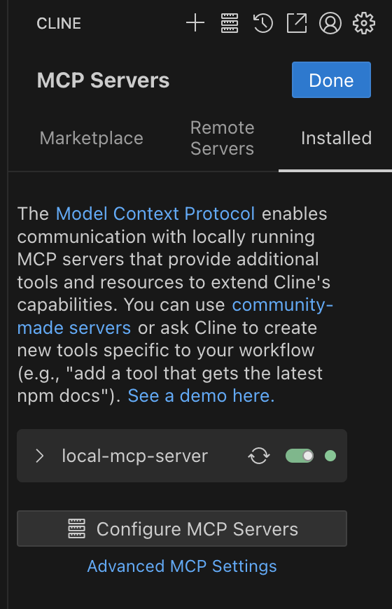

# local-mcp-server

自分用の MCP サーバ

## get started

### Cline

cline_mcp_settings.json を開き、
<>の中身を変更してください。

```json
{
  "mcpServers": {
    "local-mcp-server": {
      "command": "go",
      "args": [
        "run",
        "-C",
        "<project path>/local-mcp-server",
        "/<project path>/local-mcp-server/cmd/local-mcp-server/main.go"
      ],
      "env": {
        "GOPATH": "<${HOME}>/go",
        "HOME": "<${HOME}>"
      }
    }
  }
}
```

cline_mcp_settings.json の開き方

1. +の右側の本棚アイコンをクリック
2. 「Configure MCP Servers」をクリック


